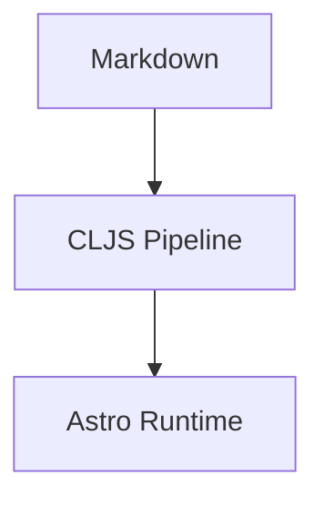

This post is authored as plain Markdown.

Inline math works: $e^{i\pi} + 1 = 0$.

## Why this shape works

- Markdown stays author-owned.
- Metadata stays overrideable.
- Rendering stays replaceable.



## Authoring contract

| Layer | Owned by | Responsibility |
| --- | --- | --- |
| Content | Author | Markdown and adjacent assets |
| Metadata | Human + system | Tags, summary, overrides |
| Runtime | Astro | Rendering only |

```clojure
{:workflow [:edit-markdown :git-push]}
```


