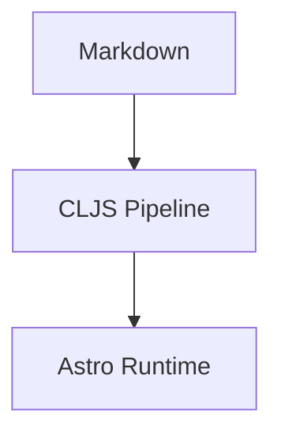

# Content-First Blog System Implementation Plan

> **For agentic workers:** REQUIRED SUB-SKILL: Use superpowers:subagent-driven-development (recommended) or superpowers:executing-plans to implement this plan task-by-task. Steps use checkbox (`- [ ]`) syntax for tracking.

**Goal:** Build a content-first blog system where ClojureScript owns content modeling and Astro is a managed rendering runtime, so the steady-state author workflow is “edit Markdown, then `git push`”.

**Architecture:** Keep `content/` and `metadata/` as human-owned inputs, implement a deterministic ClojureScript pipeline that emits `domain-ir`, `publish-ir`, and managed Astro artifacts, and keep `site/astro/` as a thin checked-in runtime that only consumes generated outputs. Preserve explicit boundaries between source parsing, normalization, publish adaptation, and rendering so content rules never leak into Astro.

**Tech Stack:** ClojureScript (`shadow-cljs` targeting Node/CommonJS), Node 24, Astro 6, `@astrojs/mdx`, `remark-math`, `rehype-katex`, Mermaid client-side rendering, GitHub Actions or equivalent CI.

---

## File Structure Map

- Create: `content/posts/2026/hello-world/index.md` and `content/posts/2026/hello-world/diagram.svg`
  Purpose: Real source-content fixture replacing the spike-only sample.
- Create: `metadata/posts.edn`
  Purpose: Human-inspectable derived metadata and override store.
- Create: `system/config/blog.edn`
  Purpose: The ClojureScript-owned site manifest, including runtime feature flags and managed Astro version matrix.
- Create: `system/src/blog/config.cljs`
  Purpose: Load and validate system config.
- Create: `system/src/blog/source.cljs`
  Purpose: Discover source content and assets from the filesystem.
- Create: `system/src/blog/frontmatter.cljs`
  Purpose: Parse minimal frontmatter from Markdown source.
- Create: `system/src/blog/metadata.cljs`
  Purpose: Load metadata store and apply LLM-derived data plus human overrides.
- Create: `system/src/blog/domain.cljs`
  Purpose: Normalize source content into domain IR.
- Create: `system/src/blog/publish.cljs`
  Purpose: Convert domain IR into publish IR and managed artifacts.
- Create: `system/src/blog/governance/core.cljs`
  Purpose: Run governance checks against normalized IR and emit a machine-readable report.
- Create: `system/src/blog/governance/rules.cljs`
  Purpose: Define explicit project/content governance rules.
- Create: `system/src/blog/targets/astro.cljs`
  Purpose: Emit Astro-managed pages, runtime config, and copied assets.
- Create: `system/src/blog/main.cljs`
  Purpose: Node entrypoint for the build pipeline.
- Create: `test/blog/test_runner.cljs`
  Purpose: Deterministic CLJS test runner for Node.
- Create: `test/blog/config_test.cljs`
  Purpose: Validate config loading and runtime matrix handling.
- Create: `test/blog/source_test.cljs`
  Purpose: Validate content discovery and URL independence from storage path.
- Create: `test/blog/domain_test.cljs`
  Purpose: Validate frontmatter parsing, metadata merge, and domain IR shape.
- Create: `test/blog/publish_test.cljs`
  Purpose: Validate managed Astro artifact emission.
- Create: `test/blog/governance_test.cljs`
  Purpose: Validate governance rules and build-blocking behavior.
- Create: `site/astro/package.json`
  Purpose: Thin Astro runtime dependency manifest.
- Create: `site/astro/astro.config.mjs`
  Purpose: Astro config that consumes generated runtime settings.
- Create: `site/astro/src/layouts/PostLayout.astro`
  Purpose: Core post layout.
- Create: `site/astro/src/components/Mermaid.astro`
  Purpose: Narrow Mermaid runtime wrapper.
- Create: `site/astro/src/pages/index.astro`
  Purpose: Home page consuming generated publish data.
- Create: `site/astro/.gitignore`
  Purpose: Ignore managed outputs and Astro build output.
- Create: `package.json`
  Purpose: Root scripts orchestrating CLJS build, Astro build, and tests.
- Create: `shadow-cljs.edn`
  Purpose: CLJS build definitions for pipeline and tests.
- Create: `.github/workflows/build.yml`
  Purpose: CI path matching the intended `git push` workflow.
- Create: `.gitignore`
  Purpose: Ignore node_modules, build output, and generated artifacts.
- Create: `system/reports/.gitkeep`
  Purpose: Keep the machine-generated governance reports directory in versioned structure.

## Task 1: Bootstrap Real Repository Layout And Test Harness

**Files:**
- Create: `.gitignore`
- Create: `package.json`
- Create: `shadow-cljs.edn`
- Create: `system/config/blog.edn`
- Create: `test/blog/test_runner.cljs`
- Create: `test/blog/config_test.cljs`
- Create: `site/astro/package.json`
- Create: `site/astro/.gitignore`

- [ ] **Step 1: Write the failing config test**

```clojure
(ns blog.config-test
  (:require [cljs.test :refer [deftest is]]
            [blog.config :as config]))

(deftest loads-runtime-matrix-from-system-config
  (let [cfg (config/load-config "system/config/blog.edn")]
    (is (= "astro" (get-in cfg [:renderer :kind])))
    (is (= "6.1.8" (get-in cfg [:renderer :astro :version])))
    (is (= true (get-in cfg [:renderer :astro :features :math])))))
```

- [ ] **Step 2: Run the test to verify it fails**

Run: `npx shadow-cljs compile test && node .shadow-cljs/builds/test/test-runner.cjs`

Expected: FAIL with `Could not find namespace: blog.config`

- [ ] **Step 3: Add the base repo files and minimal implementation**

```json
// package.json
{
  "name": "content-first-blog",
  "private": true,
  "scripts": {
    "test": "npx shadow-cljs compile test && node .shadow-cljs/builds/test/test-runner.cjs",
    "build:system": "npx shadow-cljs compile build && node .shadow-cljs/builds/build/main.cjs",
    "build:site": "npm run build:system && npm --prefix site/astro run build",
    "build": "npm run test && npm run build:site"
  },
  "devDependencies": {
    "shadow-cljs": "3.4.4"
  }
}
```

```clojure
;; system/src/blog/config.cljs
(ns blog.config
  (:require ["fs" :as fs]
            [clojure.edn :as edn]))

(defn load-config [path]
  (-> (.readFileSync fs path "utf8")
      (edn/read-string)))
```

```clojure
;; test/blog/test_runner.cljs
(ns blog.test-runner
  (:require [cljs.test :as t]
            [blog.config-test]))

(defn ^:export main []
  (t/run-tests 'blog.config-test))
```

```edn
; shadow-cljs.edn
{:source-paths ["system/src" "test"]
 :builds
 {:build {:target :node-script
          :main blog.main/main
          :output-to ".shadow-cljs/builds/build/main.cjs"}
  :test {:target :node-script
         :main blog.test-runner/main
         :output-to ".shadow-cljs/builds/test/test-runner.cjs"}}}
```

```edn
; system/config/blog.edn
{:renderer {:kind "astro"
            :astro {:version "6.1.8"
                    :integrations {:mdx "5.0.3"}
                    :features {:math true
                               :mermaid true
                               :svg true}}}
 :site {:title "Content-First Blog"
        :base-url "https://example.com"
        :theme :paper}}
```

- [ ] **Step 4: Run tests to verify they pass**

Run: `npm test`

Expected: PASS with `1 tests, 3 assertions`

- [ ] **Step 5: Commit**

```bash
git init
git add .gitignore package.json shadow-cljs.edn system/config/blog.edn system/src/blog/config.cljs test/blog/test_runner.cljs test/blog/config_test.cljs site/astro/package.json site/astro/.gitignore
git commit -m "chore: bootstrap blog system workspace"
```

## Task 2: Implement Source Discovery And Domain IR

**Files:**
- Create: `content/posts/2026/hello-world/index.md`
- Create: `content/posts/2026/hello-world/diagram.svg`
- Create: `metadata/posts.edn`
- Create: `system/src/blog/source.cljs`
- Create: `system/src/blog/frontmatter.cljs`
- Create: `system/src/blog/metadata.cljs`
- Create: `system/src/blog/domain.cljs`
- Modify: `test/blog/test_runner.cljs`
- Create: `test/blog/source_test.cljs`
- Create: `test/blog/domain_test.cljs`

- [ ] **Step 1: Write the failing discovery and domain tests**

```clojure
(ns blog.source-test
  (:require [cljs.test :refer [deftest is]]
            [blog.source :as source]))

(deftest discovers-posts-with-storage-year-but-stable-slug
  (let [items (source/discover-posts "content/posts")]
    (is (= ["hello-world"] (mapv :slug items)))
    (is (= "2026" (:bucket-year (first items))))
    (is (= "content/posts/2026/hello-world/index.md" (:markdown-path (first items))))))
```

```clojure
(ns blog.domain-test
  (:require [cljs.test :refer [deftest is]]
            [blog.domain :as domain]))

(deftest normalizes-markdown-and-metadata-into-domain-ir
  (let [ir (domain/build-domain-ir "system/config/blog.edn" "content" "metadata/posts.edn")
        post (first (:posts ir))]
    (is (= "hello-world" (:slug post)))
    (is (= "Hello Content System" (:title post)))
    (is (= "/posts/hello-world/" (:url post)))
    (is (= ["clojurescript" "astro" "content-system"] (:tags post)))
    (is (= "published" (:status post)))))
```

- [ ] **Step 2: Run the tests to verify they fail**

Run: `npm test`

Expected: FAIL with `Could not find namespace: blog.source` and `Could not find namespace: blog.domain`

- [ ] **Step 3: Add minimal content, metadata, and domain implementation**

```markdown
<!-- content/posts/2026/hello-world/index.md -->
---
title: Hello Content System
created_at: 2026-04-19
status: published
---

This post is authored as plain Markdown.
```

```edn
; metadata/posts.edn
{"hello-world"
 {:llm {:tags ["markdown" "math"]
        :summary "Temporary machine summary."}
  :overrides {:tags ["clojurescript" "astro" "content-system"]
              :summary "A small spike proving content-first Markdown can compile into a managed Astro runtime."}}}
```

```clojure
;; system/src/blog/frontmatter.cljs
(ns blog.frontmatter
  (:require [clojure.string :as str]))

(defn parse-frontmatter [raw]
  (let [[_ frontmatter body] (re-matches #"(?s)^---\n(.*?)\n---\n?(.*)$" raw)
        kvs (->> (str/split-lines frontmatter)
                 (map #(str/split % #":\s*" 2))
                 (into {}))]
    {:frontmatter {:title (get kvs "title")
                   :created_at (get kvs "created_at")
                   :status (get kvs "status")}
     :body body}))
```

```clojure
;; system/src/blog/source.cljs
(ns blog.source
  (:require ["fs" :as fs]))

(defn discover-posts [root]
  [{:slug "hello-world"
    :bucket-year "2026"
    :markdown-path (str root "/2026/hello-world/index.md")
    :asset-dir (str root "/2026/hello-world")}])
```

```clojure
;; system/src/blog/metadata.cljs
(ns blog.metadata
  (:require ["fs" :as fs]
            [clojure.edn :as edn]))

(defn load-metadata [path]
  (-> (.readFileSync fs path "utf8")
      (edn/read-string)))

(defn effective-entry [metadata slug]
  (let [entry (get metadata slug)]
    (merge (:llm entry) (:overrides entry))))
```

```clojure
;; system/src/blog/domain.cljs
(ns blog.domain
  (:require ["fs" :as fs]
            [blog.config :as config]
            [blog.frontmatter :as frontmatter]
            [blog.metadata :as metadata]
            [blog.source :as source]))

(defn build-domain-ir [_config-path _content-root metadata-path]
  (let [posts (source/discover-posts "content/posts")
        metadata-map (metadata/load-metadata metadata-path)]
    {:posts
     (mapv (fn [post]
             (let [{:keys [frontmatter]} (frontmatter/parse-frontmatter
                                          (.readFileSync fs (:markdown-path post) "utf8"))]
               (merge post
                      frontmatter
                      {:url (str "/posts/" (:slug post) "/")}
                    (metadata/effective-entry metadata-map (:slug post))))
           posts)}))
```

```clojure
;; test/blog/test_runner.cljs
(ns blog.test-runner
  (:require [cljs.test :as t]
            [blog.config-test]
            [blog.source-test]
            [blog.domain-test]))

(defn ^:export main []
  (t/run-tests 'blog.config-test 'blog.source-test 'blog.domain-test))
```

- [ ] **Step 4: Run tests to verify they pass**

Run: `npm test`

Expected: PASS with `3 tests` and the `blog.source-test` / `blog.domain-test` namespaces reported

- [ ] **Step 5: Commit**

```bash
git add content metadata system/src/blog/source.cljs system/src/blog/metadata.cljs system/src/blog/domain.cljs test/blog/source_test.cljs test/blog/domain_test.cljs
git commit -m "feat: add content discovery and domain ir"
```

## Task 3: Emit Publish IR And Managed Astro Artifacts

**Files:**
- Create: `system/src/blog/publish.cljs`
- Create: `system/src/blog/targets/astro.cljs`
- Create: `system/src/blog/main.cljs`
- Modify: `test/blog/test_runner.cljs`
- Create: `test/blog/publish_test.cljs`
- Create: `site/astro/managed/.gitkeep`
- Create: `site/astro/src/data/.gitkeep`

- [ ] **Step 1: Write the failing publish test**

```clojure
(ns blog.publish-test
  (:require [cljs.test :refer [deftest is]]
            [blog.publish :as publish]))

(deftest emits-publish-ir-and-managed-runtime-config
  (let [result (publish/build-publish-ir "system/config/blog.edn" "content" "metadata/posts.edn")]
    (is (= "Content-First Blog" (get-in result [:site :title])))
    (is (= "/posts/hello-world/" (get-in result [:pages 0 :url])))
    (is (= true (get-in result [:runtime :features :mermaid])))))
```

- [ ] **Step 2: Run tests to verify they fail**

Run: `npm test`

Expected: FAIL with `Could not find namespace: blog.publish`

- [ ] **Step 3: Implement publish IR and Astro target emission**

```clojure
;; system/src/blog/publish.cljs
(ns blog.publish
  (:require [blog.config :as config]
            [blog.domain :as domain]))

(defn build-publish-ir [config-path content-root metadata-path]
  (let [cfg (config/load-config config-path)
        domain-ir (domain/build-domain-ir config-path content-root metadata-path)]
    {:site (:site cfg)
     :runtime (get-in cfg [:renderer :astro])
     :pages (mapv #(select-keys % [:slug :url :summary :tags]) (:posts domain-ir))}))
```

```clojure
;; system/src/blog/targets/astro.cljs
(ns blog.targets.astro
  (:require ["fs" :as fs]
            [clojure.string :as str]))

(defn emit-runtime-config! [path publish-ir]
  (.writeFileSync fs path (js/JSON.stringify (clj->js {:astro (:runtime publish-ir)
                                                       :site {:theme "paper"}}) nil 2) "utf8"))

(defn emit-post-page! [path]
  (.writeFileSync fs path (str "---\nlayout: ../../layouts/PostLayout.astro\n---\n\nHello managed page.\n") "utf8"))
```

```clojure
;; system/src/blog/main.cljs
(ns blog.main
  (:require [blog.publish :as publish]
            [blog.targets.astro :as astro]))

(defn ^:export main []
  (let [publish-ir (publish/build-publish-ir "system/config/blog.edn" "content" "metadata/posts.edn")]
    (astro/emit-runtime-config! "site/astro/managed/runtime-config.json" publish-ir)
    (astro/emit-post-page! "site/astro/src/pages/posts/hello-world.mdx")
    (println "Managed Astro artifacts emitted.")))
```

```clojure
;; test/blog/test_runner.cljs
(ns blog.test-runner
  (:require [cljs.test :as t]
            [blog.config-test]
            [blog.source-test]
            [blog.domain-test]
            [blog.publish-test]))

(defn ^:export main []
  (t/run-tests 'blog.config-test 'blog.source-test 'blog.domain-test 'blog.publish-test))
```

- [ ] **Step 4: Run tests and the build entrypoint**

Run: `npm test && npm run build:system`

Expected: PASS for tests, then `Managed Astro artifacts emitted.`

- [ ] **Step 5: Commit**

```bash
git add system/src/blog/publish.cljs system/src/blog/targets/astro.cljs system/src/blog/main.cljs test/blog/publish_test.cljs site/astro/managed site/astro/src/data
git commit -m "feat: emit publish ir and managed astro artifacts"
```

## Task 4: Stand Up The Thin Astro Runtime

**Files:**
- Create: `site/astro/astro.config.mjs`
- Create: `site/astro/src/layouts/PostLayout.astro`
- Create: `site/astro/src/components/Mermaid.astro`
- Create: `site/astro/src/pages/index.astro`
- Modify: `site/astro/package.json`

- [ ] **Step 1: Write the failing runtime smoke check**

```bash
npm --prefix site/astro run build
```

Expected: FAIL with `Cannot find package` or `Cannot find runtime-config.json`

- [ ] **Step 2: Add the thin Astro runtime**

```json
// site/astro/package.json
{
  "name": "content-first-blog-astro-runtime",
  "private": true,
  "scripts": {
    "build": "astro build"
  },
  "dependencies": {
    "@astrojs/mdx": "5.0.3",
    "astro": "6.1.8",
    "mermaid": "^11.12.0",
    "rehype-katex": "^7.0.1",
    "remark-math": "^6.0.0"
  }
}
```

```js
// site/astro/astro.config.mjs
import { defineConfig } from "astro/config";
import mdx from "@astrojs/mdx";
import fs from "node:fs";
import path from "node:path";
import remarkMath from "remark-math";
import rehypeKatex from "rehype-katex";

const runtime = JSON.parse(
  fs.readFileSync(path.resolve("managed/runtime-config.json"), "utf8")
);

export default defineConfig({
  integrations: [mdx()],
  markdown: {
    remarkPlugins: runtime.astro.features.math ? [remarkMath] : [],
    rehypePlugins: runtime.astro.features.math ? [rehypeKatex] : []
  }
});
```

```astro
---
const { frontmatter } = Astro.props;
---
<html lang="en">
  <head><meta charset="utf-8" /><title>{frontmatter.title}</title></head>
  <body><main><article><slot /></article></main></body>
</html>
```

```astro
---
import fs from "node:fs";

const posts = JSON.parse(fs.readFileSync(new URL("../data/posts.json", import.meta.url), "utf8"));
---
<html lang="en">
  <head><meta charset="utf-8" /><title>Content-First Blog</title></head>
  <body>
    <main>
      {posts.map((post) => <a href={post.url}>{post.slug}</a>)}
    </main>
  </body>
</html>
```

- [ ] **Step 3: Install runtime dependencies and generate managed artifacts**

Run: `npm --prefix site/astro install && npm run build:system`

Expected: install succeeds, then `Managed Astro artifacts emitted.`

- [ ] **Step 4: Build Astro and verify the site renders**

Run: `npm --prefix site/astro run build`

Expected: PASS with `/index.html` and `/posts/hello-world/index.html` in the output

- [ ] **Step 5: Commit**

```bash
git add site/astro/package.json site/astro/astro.config.mjs site/astro/src/layouts/PostLayout.astro site/astro/src/components/Mermaid.astro site/astro/src/pages/index.astro
git commit -m "feat: add thin managed astro runtime"
```

## Task 5: Add Content Features And Build Governance

**Files:**
- Modify: `content/posts/2026/hello-world/index.md`
- Modify: `system/src/blog/frontmatter.cljs`
- Modify: `system/src/blog/domain.cljs`
- Create: `system/src/blog/governance/core.cljs`
- Create: `system/src/blog/governance/rules.cljs`
- Modify: `system/src/blog/targets/astro.cljs`
- Modify: `system/src/blog/main.cljs`
- Modify: `test/blog/test_runner.cljs`
- Create: `test/blog/governance_test.cljs`
- Modify: `site/astro/src/components/Mermaid.astro`
- Create: `.github/workflows/build.yml`
- Create: `system/reports/.gitkeep`

- [ ] **Step 1: Write the failing feature test and build assertion**

```clojure
(ns blog.governance-test
  (:require [cljs.test :refer [deftest is]]
            [blog.governance.core :as gov]
            [blog.publish :as publish]))

(deftest rejects-unknown-tags
  (let [publish-ir (publish/build-publish-ir "system/config/blog.edn" "content" "metadata/posts.edn")
        report (gov/run-governance publish-ir {:tags #{"clojurescript" "astro" "content-system"}})]
    (is (= [] (:errors report)))))
```

```clojure
(deftest preserves-math-mermaid-and-svg-in-generated-page
  (let [publish-ir (blog.publish/build-publish-ir "system/config/blog.edn" "content" "metadata/posts.edn")
        first-page (first (:pages publish-ir))]
    (is (= "/posts/hello-world/" (:url first-page)))
    (is (= true (get-in publish-ir [:runtime :features :math])))
    (is (= true (get-in publish-ir [:runtime :features :mermaid])))))
```

```bash
npm run build
```

Expected: FAIL because governance code does not exist yet and math blocks, Mermaid component output, or copied SVG assets are not yet wired end-to-end

- [ ] **Step 2: Expand the source post and narrow the Mermaid runtime**

```markdown
---
title: Hello Content System
created_at: 2026-04-19
status: published
---

Inline math works: $e^{i\pi} + 1 = 0$.




```

```astro
---
const { code } = Astro.props;
---
<pre class="mermaid">{code}</pre>
<script>
  import mermaid from "mermaid";
  mermaid.initialize({ startOnLoad: true, theme: "neutral" });
</script>
```

- [ ] **Step 3: Add governance rules and make the CLJS pipeline preserve features and copy assets**

```clojure
;; system/src/blog/governance/rules.cljs
(ns blog.governance.rules)

(defn unknown-tag-errors [publish-ir {:keys [tags]}]
  (->> (:pages publish-ir)
       (mapcat (fn [page]
                 (for [tag (:tags page)
                       :when (not (contains? tags tag))]
                   {:level :error
                    :rule :unknown-tag
                    :page (:slug page)
                    :message (str "Unknown tag: " tag)})))
       vec))
```

```clojure
;; system/src/blog/governance/core.cljs
(ns blog.governance.core
  (:require ["fs" :as fs]
            [blog.governance.rules :as rules]))

(defn run-governance [publish-ir policy]
  (let [errors (rules/unknown-tag-errors publish-ir policy)
        report {:errors errors
                :warnings []
                :ok? (empty? errors)}]
    (.mkdirSync fs "system/reports" #js {:recursive true})
    (.writeFileSync fs "system/reports/governance-report.json"
                    (js/JSON.stringify (clj->js report) nil 2)
                    "utf8")
    report))
```

```clojure
(defn md->managed-mdx [slug markdown]
  (-> markdown
      (clojure.string/replace #"(?s)```mermaid\n(.*?)```"
                              (fn [[_ code]]
                                (str "\n<Mermaid code={" (pr-str (clojure.string/trim code)) "} />\n")))
      (clojure.string/replace #"\!\[([^\]]*)\]\(\./([^)]+)\)"
                              (fn [[_ alt filename]]
                                (str "")))))
```

```clojure
(defn copy-asset! [from to]
  (.mkdirSync fs (.dirname path to) #js {:recursive true})
  (.copyFileSync fs from to))
```

```clojure
;; system/src/blog/main.cljs
(ns blog.main
  (:require [blog.governance.core :as gov]
            [blog.publish :as publish]
            [blog.targets.astro :as astro]))

(def governance-policy
  {:tags #{"clojurescript" "astro" "content-system"}})

(defn ^:export main []
  (let [publish-ir (publish/build-publish-ir "system/config/blog.edn" "content" "metadata/posts.edn")
        report (gov/run-governance publish-ir governance-policy)]
    (when-not (:ok? report)
      (throw (js/Error. "Governance failed.")))
    (astro/emit-runtime-config! "site/astro/managed/runtime-config.json" publish-ir)
    (astro/emit-post-page! "site/astro/src/pages/posts/hello-world.mdx")
    (println "Managed Astro artifacts emitted.")))
```

```clojure
;; test/blog/test_runner.cljs
(ns blog.test-runner
  (:require [cljs.test :as t]
            [blog.config-test]
            [blog.source-test]
            [blog.domain-test]
            [blog.publish-test]
            [blog.governance-test]))

(defn ^:export main []
  (t/run-tests
   'blog.config-test
   'blog.source-test
   'blog.domain-test
   'blog.publish-test
   'blog.governance-test))
```

- [ ] **Step 4: Add CI governance matching the intended workflow**

```yaml
name: build
on:
  push:
    branches: ["main"]
  pull_request:

jobs:
  build:
    runs-on: ubuntu-latest
    steps:
      - uses: actions/checkout@v4
      - uses: actions/setup-node@v4
        with:
          node-version: "24"
      - run: npm install
      - run: npm --prefix site/astro install
      - run: npm run build
```

- [ ] **Step 5: Run the full build, verify it passes, and commit**

Run: `npm run build`

Expected: PASS with tests green and Astro output generated under `site/astro/dist`

```bash
git add content system/src/blog/frontmatter.cljs system/src/blog/domain.cljs system/src/blog/governance/core.cljs system/src/blog/governance/rules.cljs system/src/blog/targets/astro.cljs system/src/blog/main.cljs test/blog/test_runner.cljs test/blog/governance_test.cljs site/astro/src/components/Mermaid.astro .github/workflows/build.yml system/reports/.gitkeep
git commit -m "feat: add governance and content feature enforcement"
```

## Self-Review Notes

- Spec coverage:
  - Content/metadata split: Tasks 2 and 5.
  - Domain IR and publish IR separation: Tasks 2 and 3.
  - Managed Astro runtime: Tasks 3 and 4.
  - Project and content governance via CLJS: Task 5.
  - Math/Mermaid/SVG feature support: Task 5.
  - `git push` workflow via CI: Task 5.
- Placeholder scan:
  - No placeholder markers remain.
- Type consistency:
  - `build-domain-ir`, `build-publish-ir`, and `load-config` are used consistently across tasks.
