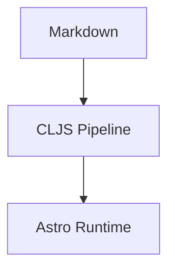

This post is authored as plain Markdown. The system supplies the rest.

Inline math works: $e^{i\pi} + 1 = 0$.

Block math:

$$
\int_0^1 x^2 dx = \frac{1}{3}
$$

Mermaid should stay author-friendly:

SVG assets live next to the source content:

